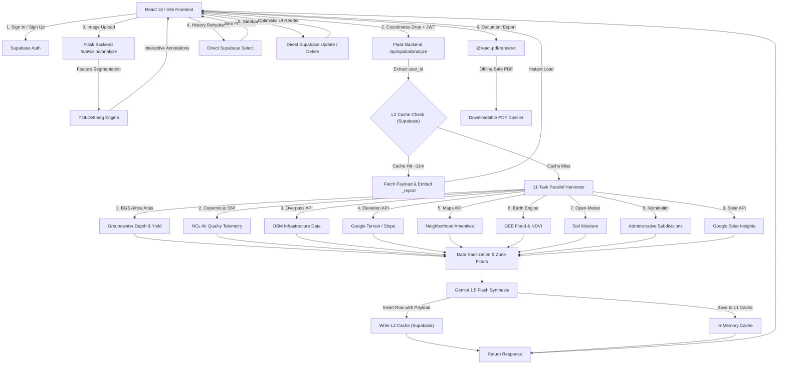

# 🏗️ Terra AI: Enterprise Land Pre-Purchase Risk Assessment Platform

[](https://react.dev/)
[](https://flask.palletsprojects.com/)
[](https://supabase.com/)
[](https://tailwindcss.com/)
[](https://ultralytics.com/)
[](https://deepmind.google/technologies/gemini/)

Terra AI is an enterprise-grade, land pre-purchase due diligence and risk assessment platform designed specifically for the Kenyan real estate market (with high-fidelity coverage spanning the entirety of Kenya). 

By fusing computer vision (**YOLOv8 Image Segmentation**) with advanced geospatial intelligence (**Shapely, OpenStreetMap, Google Maps, Google Earth Engine, Open-Meteo, BGS Africa Groundwater Atlas, and Sentinel-5P Air Quality**), Terra AI detects physical, environmental, infrastructure, and legal risks *before* a buyer commits to a purchase. The platform evaluates riparian buffer zones, road reserves, terrain slope, soil type foundations, aquifer depth, air pollution, grid connectivity, solar potential, and administrative zoning, synthesizing a professional architectural-grade **PDF Dossier** with estimated financial premiums.

---

## 📅 Recent Updates

- **Supabase SaaS Integration & Auth Gate**: Upgraded Terra AI to a full SaaS platform. Spatial queries are now locked behind a sleek dark glassmorphism authentication gate. Users must register/login to execute deep scans, with all reports tied to their accounts using PostgreSQL Row Level Security (RLS).
- **Two-Layer Geospatial Cache**: 
  - **L1 (In-Memory Cache)**: Fast 24-hour temporal memory cache.
  - **L2 (Supabase Database Cache)**: Checks database records for any pin dropped within a geotechnically identical 11-meter radius (coordinates rounded to 4 decimals). Returns historical analyses instantly to save API calls and eliminate 3+ seconds of latency.
- **ChatGPT-Style Sidebar with CRUD actions**: Created an interactive history panel allowing users to instantly rehydrate previously generated reports. Built hovering actions:
  - **Rename (Pencil)**: Inline, blur-safe name updates synced instantly to Supabase.
  - **Delete (Trash)**: A double-click safety lock (click once to arm/turn red, second click confirms) with an optimistic UI state that removes items from list immediately while deleting in the background.
  - **Standardized Aesthetics**: Cleaned up the visual clutter by removing color-coded score dots, using standard map markers for a sleek, cohesive feel.
- **Advanced Spatial Datasets**:
  - **BGS Africa Groundwater Atlas**: Performs point-in-polygon queries against the official Kenya Hydrogeology shapefile (`Kenya_HG.shp`) to discover aquifer type, productivity levels, and depth to water table. Triggers a water scarcity flag and KES 2,000,000 deep drilling premium if standard drilling cannot reach water.
  - **Copernicus Sentinel-5P Air Quality**: Connects to the Sentinel-5P NRTI L3 satellite band via Google Earth Engine to sample median tropospheric nitrogen dioxide ($NO_2$) levels over a rolling 12-month window, flagging chronic pollution above $1.0\times 10^{-4}\text{ mol/m}^2$.
- **Scroll-Free Adaptive Layout**: Optimized the spatial map canvas to scale dynamically to the exact device height (`100vh - 140px`). Buttons and action elements sit in a clean footer band underneath, making the entire flow fit on any screen without needing to scroll.
- **Auditor-Style Cost & Risk Synthesis**: Optimized Gemini 1.5 Flash report generation prompts. The AI synthesis now separates genuine hazards (landslide, flood, legal encroachment) into critical `RISK` flags, while organizing infrastructure and geotech costs into `BUDGET` items, keeping reviews pragmatic, objective, and transparent.

---

## 📖 Table of Contents
1. [Core Features & User Flow](#-core-features--user-flow)
2. [Technical Architecture](#-technical-architecture)
3. [System Dependencies & Tech Stack](#-system-dependencies--tech-stack)
4. [Strict Folder Structure](#-strict-folder-structure)
5. [Required Supabase SQL Schema](#%EF%B8%8F-required-supabase-sql-schema)
6. [Environment Variables Config](#%EF%B8%8F-environment-variables-config)
7. [Step-by-Step Installation & Run Guide](#-step-by-step-installation--run-guide)
8. [API Endpoints Reference](#-api-endpoints-reference)
9. [Kenya-Wide Spatial Heuristics & Rules](#%EF%B8%8F-kenya-wide-spatial-heuristics--rules)
10. [Verification & Development Commands](#-verification--development-commands)
11. [Legal Disclaimer](#-legal-disclaimer)

---

## 🚀 Production Benchmarking

Use `backend/benchmark_production.py` to benchmark the deployed Render backend instead of the local Flask server.

What it does:
- Calls `/health` and `/ready` first so you can confirm the deployed service is warm.
- Calls `/api/vision/analyze` with a real image upload and reports client latency plus backend timing breakdowns.
- Calls `/api/spatial/scan` with a real Bearer token and reports client latency plus backend timing breakdowns for internal phases like `parallel_tasks.overpass`, `parallel_tasks.gee_landcover`, `synthesis_ms`, and `db_write_ms`.
- Prints a ranked list of the slowest internal phases so you can see whether the delay is vision, the spatial harvester, or Gemini synthesis.

Example commands:

```bash
cd backend
./land/bin/python benchmark_production.py \
  --base-url https://YOUR-RENDER-SERVICE.onrender.com \
  --mode vision \
  --vision-image ../src/assets/front_page/hero_section.png

./land/bin/python benchmark_production.py \
  --base-url https://YOUR-RENDER-SERVICE.onrender.com \
  --mode spatial \
  --lat -1.286389 \
  --lng 36.817223 \
  --spatial-token "$TERRA_BENCH_BEARER_TOKEN"

./land/bin/python benchmark_production.py \
  --base-url https://YOUR-RENDER-SERVICE.onrender.com \
  --mode all \
  --vision-image ../src/assets/front_page/hero_section.png \
  --lat -1.286389 \
  --lng 36.817223 \
  --spatial-token "$TERRA_BENCH_BEARER_TOKEN" \
  --json-out ./benchmark_results.json
```

Required inputs:
- `--base-url`: the Render backend URL.
- `--vision-image`: any representative site photo or drone image for the vision engine.
- `--spatial-token`: a valid Supabase Bearer token from a logged-in user session, required because `/api/spatial/scan` is auth-protected.

---

## 🌟 Core Features & User Flow

### 1. The Landing Experience (`/`)
- A modern Google Gemini-inspired light-mode portal featuring clean sans-serif typography, abundant white space, and subtle micro-animations.
- Highlights SaaS capabilities, motivating buyers to log in to capture spatial reports and access their multi-device project history.

### 2. Dual-Channel Analysis Split (`/analyze`)
- Sleek, interactive routing cards directing users to their choice of:
  - **Option A (Vision Flow)**: Upload site photos or drone footage to extract spatial segments.
  - **Option B (Deep Map Flow)**: Drop a pin on a 3D satellite canvas to run a complete GIS assessment.

### 3. Cinematic Site Scanning (Vision Pipeline)
- **Cinematic Uploader & Scanner**: `CinematicScanner.jsx` uses `framer-motion` to execute a glowing green scan line across uploaded images.
- **YOLOv8 Segmentation**: Automatically parses roads, structures, vegetation, water bodies, and rocky terrain.
- **Interactive Annotations**: Places floating overlays that let users tap to see confidence levels. Can be converted to full spatial analysis by attaching coordinates.

### 4. Full-Bleed Map Stage & 11-Task Parallel Engine (Map Pipeline)
- **Scroll-Free Map Canvas**: A full-bleed map module that fills all available screen height with a clean, separated run-analysis button sitting directly below it.
- **Progressive Loader**: Displays active scan metrics in real time (e.g., *“Connecting to Copernicus satellite telemetry...”*, *“Querying BGS Groundwater Shapefiles...”*).
- **11-Task Parallel GIS Harvester**: Utilizes a Python `ThreadPoolExecutor` to query independent spatial data streams concurrently in **< 4 seconds**:
  1. **BGS Africa Groundwater Atlas**: Point-in-polygon queries against hydrogeology layers.
  2. **Copernicus Sentinel-5P**: NO₂ air pollution satellite sampling.
  3. **Overpass (OpenStreetMap)**: Computes distance to power lines, nearest roads, waterways, airports, cliffs, markets, and hospitals.
  4. **Google Maps Elevation API**: Evaluates exact terrain slope percentages and height indexes.
  5. **Google Maps Places/Details**: Contextualizes neighborhoods, administrative units, and safety infrastructure.
  6. **Google Earth Engine (GEE)**: Analyzes JRC surface water history, vegetation index (NDVI), and tree cover.
  7. **Open-Meteo API**: Fetches historical and real-time soil moisture.
  8. **Nominatim (OSM Reverse Geocoding)**: Resolves coordinates into county, subcounty, and ward names.
  9. **Google Maps Solar API**: Estimates maximum roof solar panel capacities and annual peak sun hours.

### 5. Multi-Layer Geocaching (L1 & L2)
- Fast 24-hour temporal memory cache combined with a persistent Supabase PostgreSQL database cache. 
- Prevents expensive re-queries by checking for prior pins within an ~11m radius. 

### 6. SaaS Sidebar & Report Rehydration
- **ChatGPT-Style Sidebar**: Automatically syncs completed scans to the user's account. Shows location name, date, and feasibility score.
- **One-Click Rehydration**: Clicking a sidebar item fetches the full cached payload from Supabase, rendering the entire report page instantly with zero backend Flask executions required.
- **Inline Rename & Confirm Delete**: Hovering over sidebar rows reveals editing icons. Click the pencil to change names inline, or tap the trash once to arm a double-click delete block.

### 7. Gemini AI Synthesis & Interactive QA Chat
- **Pragmatic Synthesis**: Gemini 1.5 Flash compiles raw metrics into a neutral financial assessment. Distinguishes between physical blockers (`RISK`) and transparent cost forecasts (`BUDGET`), adjusting feasibility scores accordingly.
- **Context-Aware Chat Assistant**: Chatbot allows users to ask localized questions about their reports (e.g., *"What regulations govern building a commercial retail center here?"*), referencing full GIS context.
- **Deterministic Offline Fallback**: In the event of Gemini rate limits, a fallback engine maps hard-coded spatial metrics to high-fidelity risk indicators.

### 8. Architectural-Grade PDF Dossier
- Complete client-side PDF document generation using `@react-pdf/renderer` in `TerraReportDocument.jsx`.
- **Page 1: Executive Summary**: Layout featuring coordinate tags, static maps, feasibility verdicts, and primary AI synthesis.
- **Page 2: Environmental & Topography Grid**: Visual grids mapping slope, elevation, surface water historical indexes, and interactive progress bars.
- **Page 3: Legal & Infrastructure Economics**: Outlines statutory buffers (30m NEMA riparian zone, highway encroachments), air pollution issues, and fully matched KES CapEx estimates (foundations, KPLC power connection, borehole drilling, survey, and title searches).

---

## ⚙️ Technical Architecture

The platform operates on a decoupled client-server architecture backed by Supabase:



---

## 📦 System Dependencies & Tech Stack

### Frontend Dependencies (`package.json`)
- **Core Framework**: React 18, Vite (Fast HMR)
- **SaaS Database Client**: `@supabase/supabase-js` (Auth, Direct tables select/insert/update/delete)
- **Routing**: `react-router-dom` (BrowserRouter v7)
- **Global State**: `zustand` (sessionStorage-backed persistent global engine)
- **Animations**: `framer-motion` (for cinematic scanner and UI transitions)
- **Styling**: Tailwind CSS (Tailwind Merge + CLSX for class combinations)
- **Icons**: `lucide-react` (SVG-based vector assets)
- **PDF Core**: `@react-pdf/renderer` (Declarative PDF rendering)

### Backend Dependencies (`requirements.txt`)
- **API Engine**: Flask 3.1, Flask-CORS 6.0
- **Database Client**: `supabase` (v2.15.3 Python SDK - for authenticated JWT verify and write-backs)
- **Computer Vision**: Ultralytics (YOLOv8 segmentation model `yolov8n-seg.pt`), OpenCV-Python, Pillow
- **GIS Engine**: Shapely (geometric intersections), PyShp / GeoPandas (for reading shapefile polygons), Requests
- **AI Orchestration**: Google GenAI SDK (`google-genai`), Python-Dotenv
- **Concurrency**: Python Standard `concurrent.futures.ThreadPoolExecutor`

---

## 📂 Strict Folder Structure

```text
terra_ai_3/
├── backend/                       # Flask GIS & Vision Engine
│   ├── db/                        # Database connectivity
│   │   ├── __init__.py
│   │   └── supabase_client.py     # Supabase client singleton & auth helpers
│   ├── spatial/                   # Spatial API module
│   │   ├── routes.py              # Spatial, reverse-geocode, chat, & L2 database caching
│   │   ├── shapely_engine.py      # Riparian reserve & Road setback math
│   │   ├── elevation.py           # Slope, GEE landcover, & Sentinel-5P NO2 fetches
│   │   ├── groundwater.py         # BGS Africa shapefile loader & aquifer queries
│   │   ├── maps.py                # Google Maps Geocoding & Places queries
│   │   ├── overpass.py            # OpenStreetMap API fetcher
│   │   └── gemini_synth.py        # Gemini 1.5 Flash integration & Chat prompt engineering
│   ├── vision/                    # YOLOv8 Image Segmentation module
│   │   ├── routes.py              # Photo analysis endpoints
│   │   ├── service.py             # YOLOv8 segmentation pipeline
│   │   └── image_io.py            # Base64 & byte-stream decoders
│   ├── yolov8n-seg.pt             # YOLOv8 nano segmentation weights
│   ├── app.py                     # Main server entrypoint (Port 5000)
│   └── requirements.txt           # Python dependency manifest
├── datasets/                      # Static spatial data resources
│   ├── Kenya_HG.shp               # BGS Africa Hydrogeology shapefile (aquifers)
│   ├── Kenya_HG.shx               # Shapefile spatial index
│   └── Kenya_HG.dbf               # Shapefile attribute table
├── src/                           # React Frontend Application
│   ├── assets/                    # Static vectors & brand imagery
│   ├── lib/
│   │   └── supabaseClient.js      # Supabase JS client config
│   ├── store/
│   │   └── useTerraStore.js       # Zustand persistent global state (sessionStorage)
│   ├── components/
│   │   ├── auth/
│   │   │   └── AuthModal.jsx      # Dark glassmorphism authentication modal
│   │   ├── layout/                # Sidebar.jsx (CRUD history), TopBar.jsx, MainLayout.jsx
│   │   ├── ui/                    # Button.jsx, Card.jsx, Tooltip.jsx, Loader.jsx
│   │   ├── vision/                # Uploader.jsx, CinematicScanner.jsx, AnnotationPins.jsx
│   │   ├── map/                   # InteractiveMap.jsx, LocationSearch.jsx, PinDrop.jsx
│   │   ├── results/               # RiskSummaryCard.jsx, ChatAssistant.jsx, ProgressiveLoader.jsx
│   │   └── pdf/                   # TerraReportDocument.jsx (Pages 1-3 PDF structure)
│   ├── pages/
│   │   ├── Home.jsx               # Floating isometric landing page
│   │   ├── Analyze.jsx            # Vision vs. Map split choice & scroll-free wrapper
│   │   ├── Pricing.jsx            # SaaS pricing tiers
│   │   └── Report.jsx             # Final visual workspace before PDF print
│   ├── utils/                     # Local helpers
│   ├── App.jsx                    # Router config & Page transitions
│   └── main.jsx                   # React DOM render hook
├── .env                           # Global environment secrets
├── .env.example                   # Shared template for local secrets
├── tailwind.config.js             # Strict design system tokens
└── start_backend.ps1              # Automation startup script for Windows PowerShell
```

---

## ⚡ Required Supabase SQL Schema

Before running the application, you **must** configure your database schema inside the Supabase dashboard SQL editor.

```sql
-- 1. Create the reports table
CREATE TABLE reports (
  id UUID PRIMARY KEY DEFAULT gen_random_uuid(),
  user_id UUID REFERENCES auth.users(id) ON DELETE CASCADE,
  location_name TEXT,
  feasibility_score INTEGER,
  payload JSONB NOT NULL,
  lat_rounded NUMERIC(8,4) NOT NULL,
  lng_rounded NUMERIC(8,4) NOT NULL,
  created_at TIMESTAMPTZ DEFAULT NOW()
);

-- 2. Create index on rounded coordinates for L2 cache checks
CREATE INDEX idx_reports_cache ON reports(lat_rounded, lng_rounded);

-- 3. Enable Row Level Security (RLS)
ALTER TABLE reports ENABLE ROW LEVEL SECURITY;

-- 4. Create RLS Policies so users can only access their own records
CREATE POLICY "Users can insert their own reports" 
  ON reports FOR INSERT 
  WITH CHECK (auth.uid() = user_id);

CREATE POLICY "Users can view their own reports" 
  ON reports FOR SELECT 
  USING (auth.uid() = user_id);

CREATE POLICY "Users can update their own reports" 
  ON reports FOR UPDATE 
  USING (auth.uid() = user_id);

CREATE POLICY "Users can delete their own reports" 
  ON reports FOR DELETE 
  USING (auth.uid() = user_id);
```

---

## 🔑 Environment Variables Config

Create a `.env` file in the root of the project. The Flask backend loads variables directly from the project root.

```ini
# ==============================================================================
# Terra AI Environment Configuration
# ==============================================================================

# 1. Gemini API Key (Used by backend/spatial/gemini_synth.py for report synthesis)
GEMINI_API_KEY=your_gemini_api_key_here

# 2. Google Maps API Keys
# Backend key (used for Elevation API, Solar API, and Geocoding APIs)
GOOGLE_MAPS_API_KEY=your_google_maps_api_key_here

# Frontend key (prefixed with VITE_ to be exposed to the browser for satellite mapping)
VITE_GOOGLE_MAPS_API_KEY=your_google_maps_api_key_here

# 3. Google Earth Engine Key (Optional; fallback values are injected if missing)
GOOGLE_EARTH_ENGINE_API_KEY=your_gee_api_key_here

# 4. Supabase SaaS Keys
# Backend connection secrets
SUPABASE_URL=https://your-supabase-project.supabase.co
SUPABASE_ANON_KEY=your-supabase-anon-key-here

# Frontend connection secrets (prefixed with VITE_ for client-side execution)
VITE_SUPABASE_URL=https://your-supabase-project.supabase.co
VITE_SUPABASE_ANON_KEY=your-supabase-anon-key-here

# 5. Port Configuration
PORT=5000
```

---

## 🚀 Step-by-Step Installation & Run Guide

### 1. Prerequisites
- **Node.js**: v18.0.0 or higher
- **Python**: v3.8.0 up to v3.12.0 (Required for YOLO/PyTorch modules)
- **Git**
- **GDAL/Fiona Dependencies** (If installing `geopandas` manually on Windows; otherwise the app will gracefully default to standard python shapefile readers or mock calculations if import fails)

---

### 2. Running the Flask Backend

#### Option A: Quick-Start (Windows PowerShell)
From the project root, run the pre-configured automation script. It automatically builds a virtual environment, installs dependencies, loads environmental flags, and starts the server:

```powershell
.\start_backend.ps1
```

#### Option B: Manual Setup (All Operating Systems)
1. Navigate to the `backend/` directory:
   ```bash
   cd backend
   ```
2. Create a virtual environment:
   ```bash
   python -m venv venv
   ```
3. Activate the virtual environment:
   - **Windows (PowerShell)**:
     ```powershell
     .\venv\Scripts\Activate.ps1
     ```
   - **Windows (CMD)**:
     ```cmd
     .\venv\Scripts\activate.bat
     ```
   - **macOS / Linux**:
     ```bash
     source venv/bin/activate
     ```
4. Install python dependencies:
   ```bash
   pip install -r requirements.txt
   ```
5. Run the Flask Server:
   ```bash
   python app.py
   ```
   *The backend should boot successfully on `http://localhost:5000`.*

---

### 3. Running the React Frontend

1. Navigate to the project root directory (if not already there):
   ```bash
   cd ..
   ```
2. Install frontend dependencies:
   ```bash
   npm install
   ```
3. Boot the Vite Development Server:
   ```bash
   npm run dev
   ```
4. Open your browser and navigate to `http://localhost:5173`.

---

## ⚡ API Endpoints Reference

### 1. Visual Object Detection & Segmentation
- **Endpoint**: `POST /api/vision/analyze`
- **Request Type**: `JSON` or `Multipart Form`
- **Expected Payload**:
  ```json
  {
    "image": "data:image/jpeg;base64,/9j/4AAQSkZJRg..."
  }
  ```
- **Response**:
  ```json
  {
    "annotations": [
      {
        "class_id": 0,
        "class_name": "vegetation",
        "box": [110, 45, 320, 480],
        "confidence": 0.89,
        "polygon": [[110, 45], [115, 60], [320, 480]]
      }
    ],
    "image_width": 1024,
    "image_height": 768
  }
  ```

---

### 2. Multi-API Spatial Analysis
- **Endpoint**: `POST /api/spatial/analyze`
- **Request Type**: `JSON`
- **Headers**:
  ```http
  Authorization: Bearer <JWT_access_token>
  ```
- **Expected Payload**:
  ```json
  {
    "lat": -1.286389,
    "lng": 36.817223,
    "clientContext": {
      "plannedUse": "Residential Apartment"
    },
    "visionContext": null
  }
  ```
- **Response**:
  ```json
  {
    "success": true,
    "payload": {
      "coordinates": { "lat": -1.286389, "lng": 36.817223 },
      "county": "Nairobi",
      "subcounty": "Westlands",
      "ward": "Kilimani",
      "elevation_m": 1680.5,
      "slope_percent": 3.2,
      "riparian_breach": false,
      "nearest_waterway_m": 120.4,
      "road_reserve_risk": false,
      "nearest_road_m": 12.5,
      "distance_to_grid_m": 45.0,
      "aviation_risk": false,
      "solar_available": true,
      "annual_sunshine_hours": 2007.0,
      "max_panels": 18,
      "groundwater": {
        "water_scarcity_risk": false,
        "aquifer_productivity": "Moderate",
        "depth_to_groundwater_m": 80.0,
        "borehole_premium_kes": 0,
        "hydrogeology_description": "Volcanic rocks and interbedded sediments of high hydrogeological potential.",
        "data_source": "bgs_kenya_hg"
      },
      "environment": {
        "severe_air_pollution": false,
        "no2_mol_per_m2": 0.00004512,
        "pollutant_type": "NO2",
        "no2_data_source": "Sentinel-5P NRTI"
      },
      "data_quality": {
        "overpass_success": true,
        "elevation_success": true,
        "gee_success": true,
        "maps_success": true,
        "solar_success": true,
        "admin_success": true,
        "weather_success": true,
        "groundwater_success": true,
        "no2_success": true
      }
    },
    "report": {
      "overall_risk_score": 15,
      "overall_risk_label": "LOW",
      "executive_summary": "This site in Kilimani, Nairobi exhibits excellent building feasibility. Slope angles are gentle (3.2%) requiring standard strip foundations. The plot is safely outside the statutory 30m riparian buffer zone, with immediate proximity to standard municipal infrastructure.",
      "investment_verdict": "SAFE TO PROCEED TO DUE DILIGENCE",
      "sections": [
        {
          "id": "legal",
          "title": "Legal & Regulatory",
          "risk_level": "low",
          "body": "No active overlaps with public road or railway reserves detected. Confirmed outside riparian buffer boundaries."
        }
      ],
      "cost_summary": {
        "estimated_foundation_premium_kes": 0,
        "estimated_grid_connection_kes": 0,
        "borehole_premium_kes": 0,
        "title_search_cost_kes": 500,
        "recommended_survey_cost_kes": 25000,
        "total_pre_purchase_due_diligence_kes": 25500
      }
    },
    "report_source": "gemini",
    "model_used": "gemini-1.5-flash"
  }
  ```

---

### 3. Interactive Report Q&A
- **Endpoint**: `POST /api/spatial/chat`
- **Request Type**: `JSON`
- **Expected Payload**:
  ```json
  {
    "question": "What kind of foundation do I need if the soil has black cotton?",
    "payload": { ... },
    "report": { ... },
    "history": []
  }
  ```
- **Response**:
  ```json
  {
    "success": true,
    "answer": "Since this site is located in a zone known for High-Density Black Cotton Clay (Kasarani/Ruiru belt), standard strip foundations will fail due to soil expansion. You are statutory required by the NCA to run a soil investigation (KES 30,000-80,000) and design a reinforced concrete raft foundation or piled system. Expect a foundation premium KES 800,000-1,500,000 above standard build costs."
  }
  ```

---

## 🏛️ Kenya-Wide Spatial Heuristics & Rules

To ensure industry relevance and high precision, the backend embeds local Kenyan regulations and geological characteristics:

### 1. Statutory Riparian Reserves (NEMA / Water Act 2016)
- **Rule**: Minimum **30-meter** buffer distance from the high-water mark of any river, stream, or water body.
- **Action**: Any coordinates dropped within 30 meters of a waterway detected via Shapely intersecting OpenStreetMap vectors will trigger a **CRITICAL** riparian warning, as NEMA prohibits permanent building on these plots.

### 2. Road Reserve Encroachment (KeNHA / KURA / KeRRA)
- **Rule**: Minimum setback requirements from major transport networks.
- **Action**: Intersects the dropped pin coordinates with county highway easements. A proximity of less than **15 meters** from primary local trunk roads flags an immediate road reserve setback warning.

### 3. Foundation Economics (NCA Heuristics)
The engine automatically classifies foundations and CapEx premiums based on slope percentage from the Google Elevation API:

| Slope Percentage | Classification | Structural Foundation Requirement | Est. Foundation Premium (KES) |
| :--- | :--- | :--- | :--- |
| **< 5%** | Flat | Standard Strip / Pad foundation | KES 0 |
| **5% - 12%** | Gentle | Minor leveling & stepped foundations | KES 200,000 - 500,000 |
| **12% - 20%** | Moderate | Retaining walls, mandatory soil test | KES 800,000 - 1,500,000 |
| **> 20%** | Steep | Reinforced Raft or Piled foundation | KES 1,500,000 - 3,000,000+ |

### 4. Local Geotechnical Classifications
The engine parses geocoded sub-county and ward labels to inject known regional geological issues:
- **Kasarani, Ruiru, Juja, Thika Road**: Flags high-density **Black Cotton Soil** (vertisols) which have strong shrink-swell behaviors. Sets the foundation premium warning to KES 800k-1.5M.
- **Karen, Lang'ata, Lavington, Ngong**: Identifies stable **Red Laterite (Murram)**, signaling moderate-to-good load-bearing capacities and standard structural foundation bills.
- **Athi River, Syokimau, Kitengela**: Injects warning about **Alluvial Deposits** and variable load capacities with a high risk of differential settlement, mandating local soil testing.

### 5. Aquifer Water Scarcity
Parsed from the BGS Africa shapefiles for Kenya. If the estimated depth to the aquifer table exceeds **150 meters** or the primary classification yields low/minor productivity:
- Triggers a **Water Scarcity Warning** in the PDF report and user dashboard.
- Appends a mandatory **KES 2,000,000 deep rotary borehole drilling premium** to the project development CapEx summary.

### 6. Chronic Air Pollution ($NO_2$)
Analyzed from the Copernicus Sentinel-5P orbital bands. If the tropospheric vertical column number density is determined to exceed **$1.0\times 10^{-4}\text{ mol/m}^2$**:
- Flags an **Air Quality Warning** in the PDF report and user dashboard.
- Injects guidance regarding occupancy health risks, potential suppression of rental yield demand, and mandates a NEMA Air Quality impact assessment.

---

## 🛠️ Verification & Development Commands

### Running ESLint Checks
Validate code styling, hook setups, and syntax requirements:
```bash
npm run lint
```

### Building for Production
Pre-compile and bundle the React application into optimal, lightweight static assets in the `/dist` directory:
```bash
npm run build
```

---

## ⚠️ Legal Disclaimer

> [!WARNING]
> **Terra AI** is a decision-support platform designed to assist land buyers with preliminary digital due diligence. The reports, zoning analysis, slope percentages, riparian borders, air quality, hydrogeology, and financial evaluations synthesized by our AI engine and GIS sources represent heuristic estimations.
> 
> This software **does not** replace an official physical site survey conducted by a licensed surveyor under the **Ministry of Lands and Physical Planning**, nor does it substitute statutory geotechnical testing or official **NEMA (National Environment Management Authority)** environmental impact assessments. Always verify beacons, titles, and county zoning rules on the ground before completing real estate purchases.
