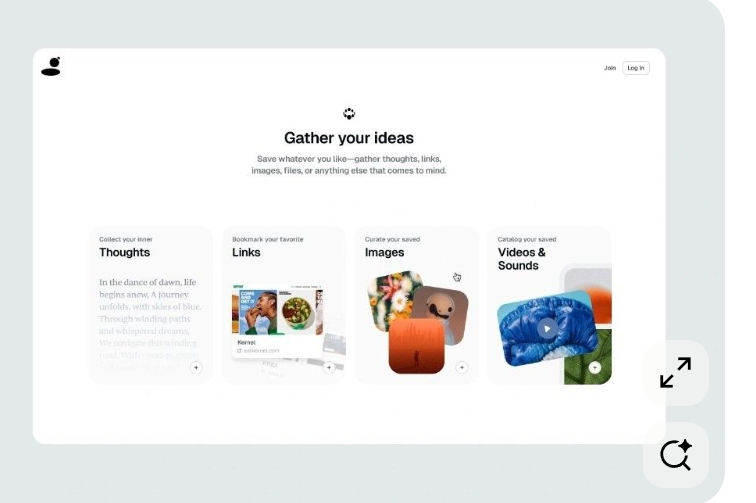
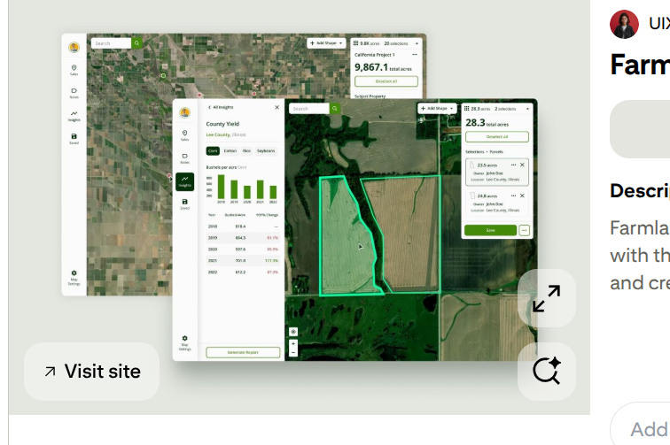

The following are some changes I want us to make:

For the Terra AI upload image card do the following:

(a) I have just attached an image of how we change that frontend design. Here we will have the following moderations:

- Have a heading at the top "Where your Idea begins" and a sentence at the bottom "Terra Lens has the ability to see and understand what you see"

Then at the side have the images in full size appear when I press upload, that card is there but its just too small, it edits and crops some images. The card should say "Pictures in your Device..."

When I pick an image, bring up step 2: picking the location beautifully

Here it brings a small short 2 second loading state that says:

"Your Land by Design, Loading Satellite Imagery..." on a blank white small card just next to the button "pick location" let the card borders look like they are blinking. 

(b) Add locations on the GEE Satellite imagery, the search bar does not give suggestions as of now so we need it to give beautiful location suggestions as the user types. 

- When someone picks a location can we have a boundary like on  that designates the land beautifully. 

(c) When we press "Analyze site" remove all that scanning image stuff; just go back to the image and have it occupy full screen but have like a 5 second loading cards with statements like "Terra Lens is (synthesizing/pondering/crafting/composing) the words in brackets should be in the following design the middle letters should be faded more than the beginning and final letters for example:

cr(bold)aft(faded) ing(bold)

Then those words should each last like 1.5 seconds each so that like 6s max

Then after the 6 seconds drawing annotations appear in places I will designate later which will work in the demo with terra copilot.

so flow is:

press upload --> cards with images appear  ---> pick a location --->pick location via suggestions in GEE --->Area picked lights up and is shaded ---> We analyze site and the image picked earlier fills 100% of the viewport --->loading state --->annotations will be made when i designate

As of now the demo will use Tigoni, Limuru, Kenya so take note of that so finally in the demo that is the location we will offer to the audience but make it natural.