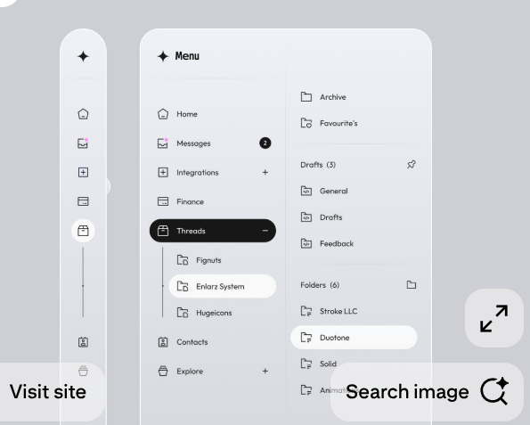
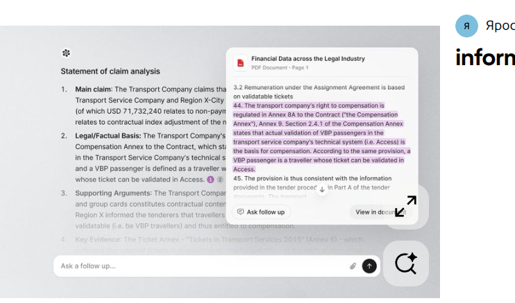
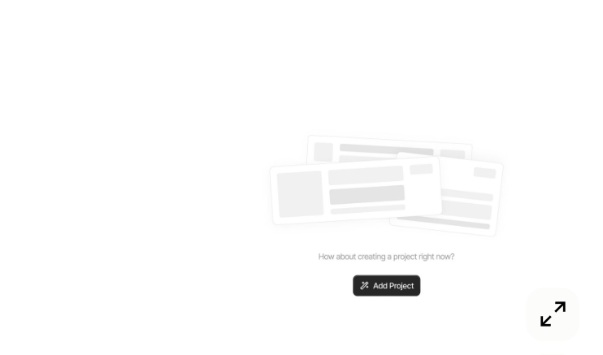
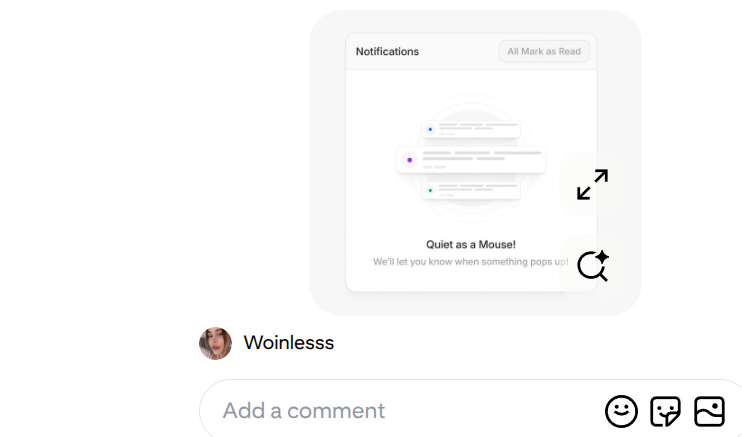

The following is how I want Terra Lens to function:

We will have 3 questions to Terra Copilot once  this is  basically like the .jpg>)

In the former one, I have given you an annotated image with what I want you to focus on.The annotations are of the areas Terra copilot will be asked questions about during the demo. 

we have 3 colors used in the annotations, white, red,and green. The white is for two chunks of land. The red is for the hilly area in the background while the green is for the sky. 

It will work in the following way:

- Look at both images and make an "annotations.json" file which will be used to recognize and "remember" the areas of interest in the images please. You could use polygons to mark the areas of interest in the image. 

The areas of interest will be used to questions Terra Copilot in the following way:

(i) User annotates on image
(ii) Terra Copilot text box appears on the annotated area and despite what the user asks you load the response I will give you. 
(iii) I do this with the next spot then the third spot, all of which I will give you the responses I want you to load. 

On the sidebar on the right, I will ask you one question which will then lead to Terra Planner where you will have a loading state "generating your plan"

In this loading state, it will appear on side chat panel with different phrases like:

- "Ideas Taking Shape", "Building the Physical world" with a spinning loader

- Then have a response like "Your Plan is generated, you can open your plan", here the user then navigates to Terra Planner where they can view the plan.

Terra Planner on the planner page will have the following features:
- a vertical menu on the left like for project navigation with the following sections:
  
# Terra Planner
## Product Vision

**Project:** Kilimani Residences  
**Type:** 120 Unit Apartment Complex

Terra Planner is not a task manager. It is an AI-native construction operating system that guides a project from planning to completion. Every module answers a different question about the project while Terra Copilot provides context-aware recommendations throughout.

---

# Navigation

- Overview
- Site
- Plan
- Build
- Resources
- Budget
- Workspace
- Reports

---

# Overview

The command center for the entire project.

### AI Project Summary

> Kilimani Residences is suitable for a medium-density residential development. Current priority is completing the geotechnical survey before structural design.

### Project Health

- 🟢 Project Health — 91%
- 🟢 Budget Health
- 🟡 Timeline Confidence
- 🔴 Top Risk
- 🟢 Team Activity

### Today's Decisions

- Approve Geotechnical Survey
- Begin Permit Submission
- Verify Utility Connections

### Recent Activity

- Architect uploaded Revision B
- Surveyor uploaded Drone Survey
- Client approved Concept Design
- Terra detected 3 decisions requiring review

---

# Site

Everything inherited from Terra Lens.

## Sections

- Original Site Images
- Annotated Images
- Terrain Analysis
- Drainage
- Vegetation
- Utilities
- Road Access
- Buildability Score
- Site Constraints
- AI Recommendations

Example:

> This site is highly suitable for a 120-unit apartment development. Drainage mitigation is recommended along the western boundary.

---

# Plan

Everything before construction begins.

## Modules

- Feasibility Checklist
- Geotechnical Survey
- Environmental Assessment
- Utility Verification
- Legal Documentation
- Architectural Planning
- Structural Planning
- Permit Tracking

## AI Copilot

Questions

> What should I do first?

> What's the biggest risk?

> What approvals are missing?

> If this were your project what would you do next?

> Explain this project in 30 seconds.

> How can I reduce delays?

---

# Build

Execution phase.

## Construction Checklist

- Site Preparation
- Excavation
- Foundation
- Structural Works
- Roofing
- MEP
- Interior Finishes
- Landscaping
- Final Inspection

Progress indicators show completion status.

AI continuously updates recommendations as work progresses.

---

# Resources

Everything needed around the project.

## Materials Nearby

- Cement Suppliers
- Steel Suppliers
- Ready Mix Concrete
- Timber Suppliers
- Electrical Suppliers
- Plumbing Suppliers

## Services Nearby

- Architects
- Structural Engineers
- Surveyors
- Contractors
- Equipment Rental
- Environmental Consultants

Future capability:

> Terra recommends the best suppliers based on price distance and availability.

---

# Budget

Financial intelligence.

## Sections

- Estimated Cost
- Actual Cost
- Procurement
- Material Costs
- Labour Costs
- Budget Breakdown
- Budget Health

AI Insights

> Foundation redesign may increase costs by approximately 8%.

> Delaying procurement could reduce storage expenses.

---

# Workspace

The collaborative heart of Terra.

## Features

- Team Invitations
- Messages
- Audio Calls
- Video Meetings
- Shared Files
- Comments
- Activity Feed

Example Demo

Architect uploads Revision C.

Immediately Terra says:

> Building footprint increased by 12%.

> Estimated concrete volume increased.

> Structural review recommended before approval.

---

# Reports

Generate professional reports instantly.

Available Reports

- Executive Report
- Investor Report
- Architect Report
- Site Report
- Weekly Progress Report
- Compliance Report

Every report includes

- Executive Summary
- Site Intelligence
- Risks
- Opportunities
- AI Recommendations
- Images
- Project Metadata

---

# Terra Copilot

Present throughout every module.

Rather than answering generic questions, Copilot provides project-specific guidance.

Example Questions

> What keeps this project from starting?

> Which decision saves the most money?

> What should I prioritize today?

> What changed since yesterday?

> Summarize the project.

> Generate an investor update.

> Explain this project to a first-time client.

---

# Design Philosophy

Terra Planner should never feel like project management software.

It should feel like an AI project partner.

Every screen should answer one question:

- **Overview** → How is my project doing?
- **Site** → What do we know about the land?
- **Plan** → What should happen before construction?
- **Build** → What should happen during construction?
- **Resources** → Who and what do I need?
- **Budget** → Are we financially healthy?
- **Workspace** → Is everyone aligned?
- **Reports** → How do I communicate progress?

The experience should make users feel like Terra is continuously thinking alongside the team rather than simply storing project information.

I should be able to click somewhere, highlight the text and ask copilot using a menu  

All these are menus on the left vertical menu, with a vertical bar with high border radius

So this page has the following design decisions:

(a) the vertical menu has high border radius
(b) the middle 70% is the planner 
(c) the right 20% is the side chat panel with copilot
(d) The middle is basically the planner answering everything on that context eg "build", "resources"
(e) This middle section should be divided into cards of different colors eg white, blue, green, orange, etc
(f) It should have icons and images which I will load later to make the presentation more beautiful.
(g) The right vertical panel is copilot. It should have a chat interface. 
(h) On the top right of the middle panel, it should have a button
(i) By far the most important design decision, is each page when selected in the vertical menu it loads that context in the middle panel. It does not open a new page. It just updates the middle panel with the context of the page selected. 
(j) But we need to add a waiting loading state that makes it look like the text is about to fill up and the AI is thinking. It should be a beautiful animation.  or or 
(i) The design should be so beautiful with headings and sub headings 

Basically the whole point is to build an answer that helps a builder see the process of pre-construction, post-construction and during construction in a way that it tells them what is happening, what should happen next, what has happened and what needs to be done. It should be a beautiful, interactive and engaging experience.

