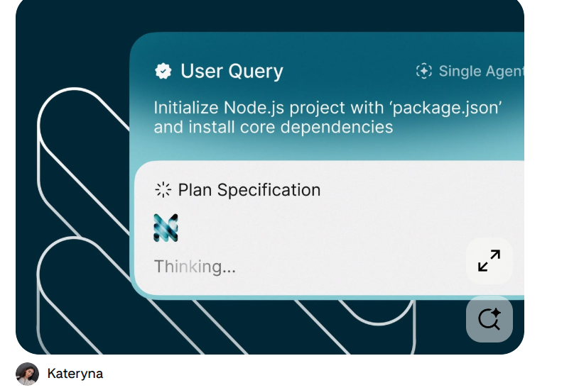
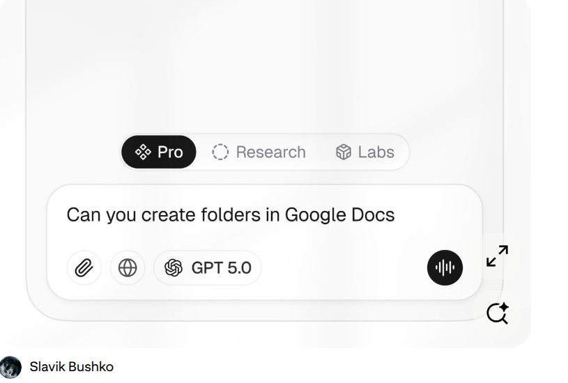
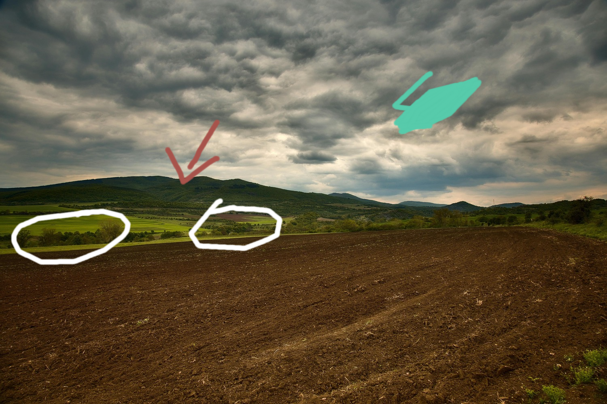
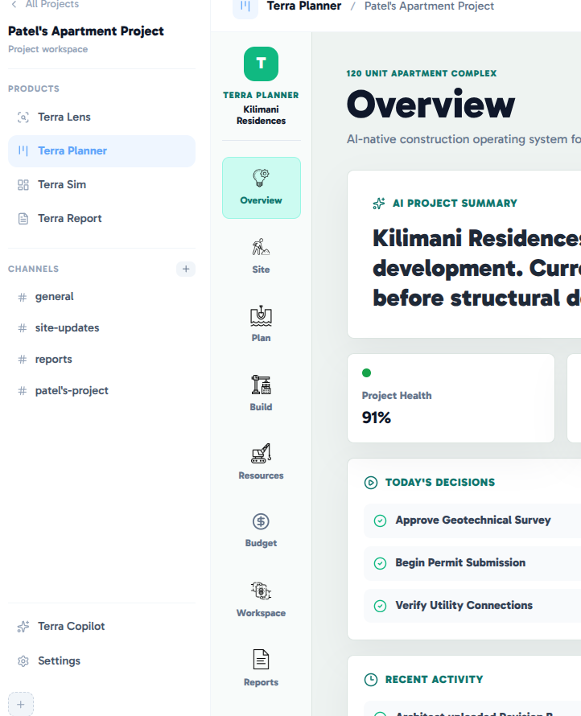
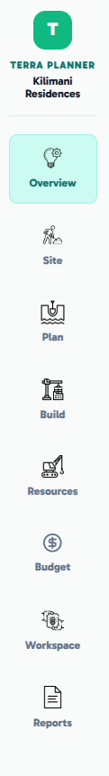
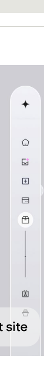
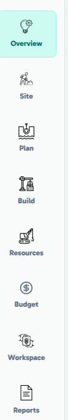
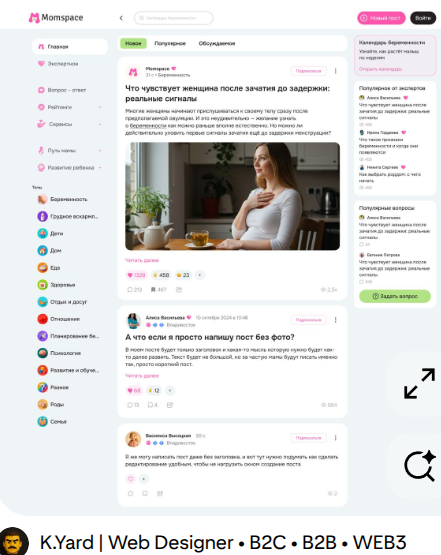
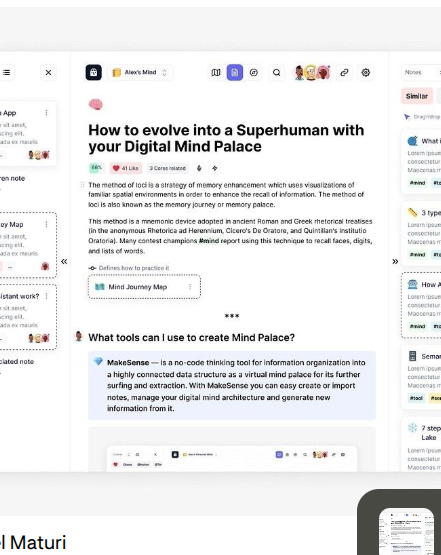
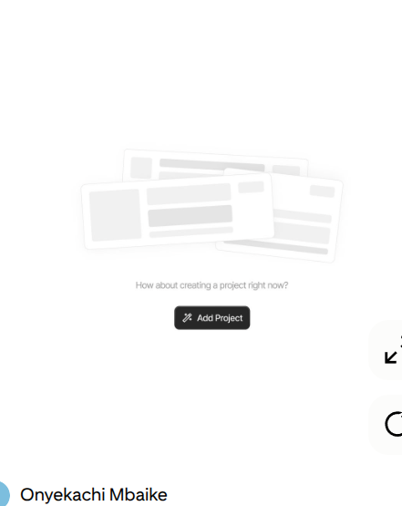

The following are changes I want us to make to the app as of now:

(1) The satellite page with the words like "synthesizing", "pondering" etc Those sentences have a line break and the words are too large. The change I need is:

- Make that card smaller add this loading gif and make the sentence be one flowing line, in the verb words, could you add a glow animation to make it look like energy is flowing through the word like in 

(2)  I want us to redesign the sidechat panel with Terra Copilot on the lens page and all the other page. On Lens, it is dark blue, change to white. [text](src/assets/ai_chat) the appropriate icons are in this folder. For each add appropriate functionalities at the back. Use these images for inspiration 

- In the textbox, have the text "Message Terra..." then at the top have the greeting "Hello {name from user table}, What do you want to dive in today" just small beautiful text at the top of the panel in black text over white bg
- Add the  when generating the terra plan and make it look like there is thinking happening

- When I ask a question, have like a faded word saying "thinking" like the one in  which happens in a 2 second lag then a response occurs.
- The small draw mode chat boxes are dark blue, make them white and add the functionality at the top, with the design specifications I have mentioned.

- On Terra lens, the menu at the bottom for annotations needs to be white background.

**Terra Lens Questions & Responses**:

I want to define the questions I will ask during the demo and the responses I want. 
**Green  draw on Sky**

Question by voice using(): "The clouds are dark, is this place prone to rain?" 

Terra Copilot Response: "Yes, in Tigoni - it gets really cold..."

**Red draw on image:**

Question by voice: "From a design perspective, do you think we should build facing the hills or not..."

Response: "Well, how you build aesthetically depends on both your preferences as person and what exactly you are building, for a tourism estate...and for an ordinary residential home..."

**Two circles made on image:**

Question by voice: "These are two spaced pieces of land, what can you see different from each other?"

Response: () for a beautiful response

Have beautiful aesthetic responses:

**TERRA PLANNER DESIGN MODIFICATIONS:**

(1) The sidebar on the left with the different products and channels, make it collapsible since  its currently static, have like a "-" that allows a user to remove it fully or minimize it off the page.

(2) This  vertical bar needs to look exactly like  it needs to float with high border radius and have the icons just as they are right now. 

**Content Modifications**

a. It is written Kilimani Residences as the project, it needs to change to "Highlands of Limuru" as the name of the project

b. As of now, the different stuff are so brief when I press a tab to learn about what Terra Planner says about my project.

The project is about building a residential estate at the Highlands of Limuru. When I press overview, site, plan, etc all should be really extensive information about building that residential estate in the highlands of Limuru. 
Use the following to have inspiration of what I need in the middle tab

Like when I click on each it answers this(but note this is all preloaded for a demo, so we all known. All information comes from [text](presentation_mode)):

Overview
↓
Can this project succeed?

Site
↓
What have we learned about the land based on backend variables in [text](backend) ?

Plan
↓
How should we design the community?

Build
↓
How do we turn the plan into reality?

Resources
↓
Who and what do we need?

Budget
↓
Can we afford it and optimize it?

Workspace
↓
How do people work together?

Reports
↓
How do we communicate progress and decisions?

- All this is true and accurate but generate in a pseudo manner
- The report tab should take you to the "report" page where I will load a fake report later
- So basically your job is to think about what building in Tigoni should look like and write it end to end on Terra Planner

- **Content should be formatted in the following ways:**

(1) Bold headings
(2) Information should be arranged inside beautiful colored cards
(3) Each card should have like 6 sentences
(4) Each tab should have atleast 6 cards of information
(5) How the information is presented and arranged depends on what the tab is about 
(6) Add the images sprinkled relevantly from the following folder [text](presentation_mode/planner_images)
(7) When I open a tab eg Resources, I should see the "AI Thinking for like 3 seconds" then it starts typing. Words should be typed letter by letter to fill the card but filling the card should never take more than 3500ms
(8) Add an empty sentence holder like in to show that some text is about to appear after thinking is done

Note: All this information is already preloaded and fake, what we are working on is how they are presented to a user. 

**AI Functionality:**

I will tell you about this later on Terra Planner